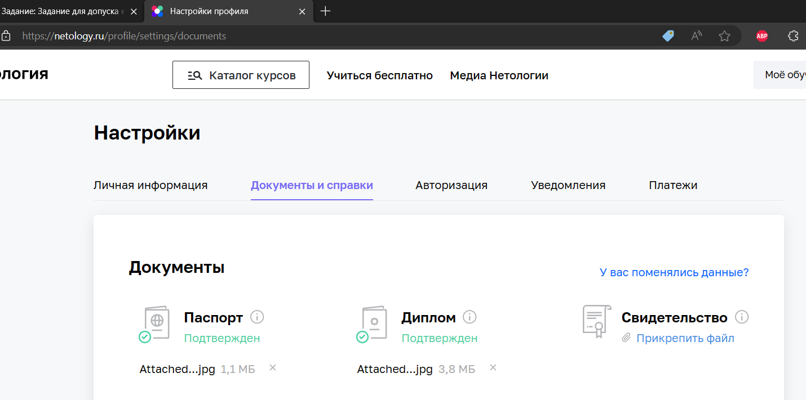

# Итоговый модуль профессии Java-разработчик #
###
## Q: Получилось ли у вас загрузить в личный кабинет документы, подтверждающие личность, и диплом о высшем или среднем специальном образовании? ##
## A: Да. Скриншот личного кабинета: ##
 "https://netology.ru/profile/settings/documents"
###
## Q: Нужна ли вам справка об обучении после сдачи дипломной работы? Справка выдаётся всем студентам, в том числе тем, у кого нет диплома о высшем или среднем специальном образовании.
## A: Нет, справка не нужна
###
## Q: Выполнен ли вами необходимый минимум заданий на каждом модуле профессии для допуска к дипломной работе?
## A: Да
